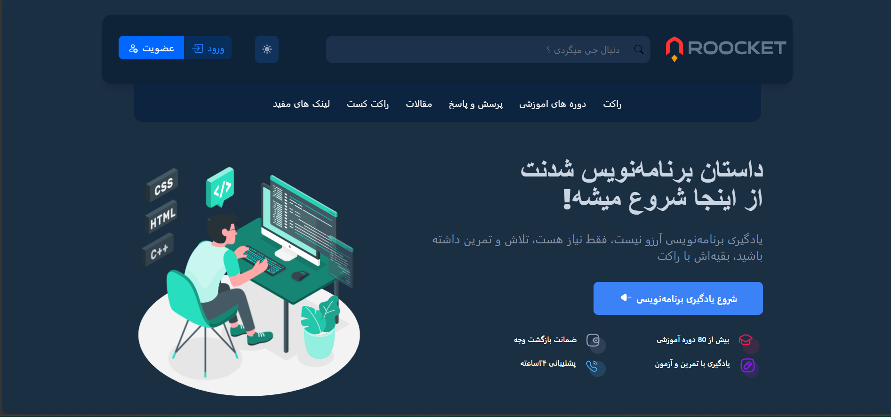
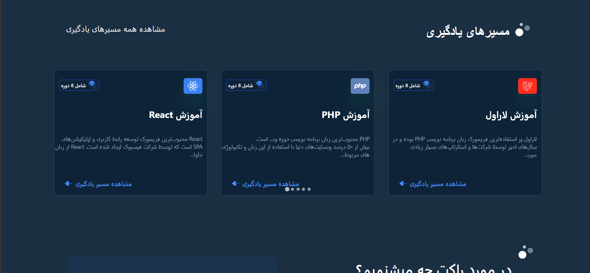
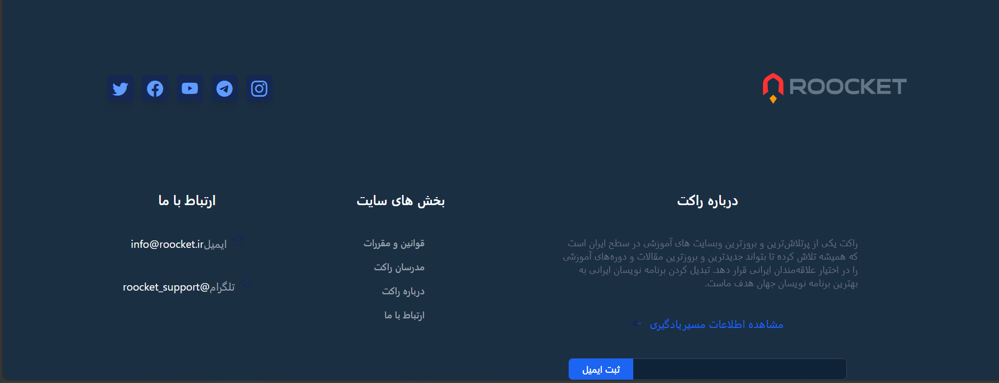

## Hello
This project is built with the Tailwind framework.

## Getting Started

### Prerequisites
What you need to install the software and how to install them.

### Installing
A step-by-step guide to get a development environment running.

1. Clone the repository:
   ```sh
   git clone <repository-url>
   ```

2. Open the cloned folder.

3. Open the project folder, then open the `src` folder and run `index.html`.

### Alternative Method
Open the terminal and enter these commands:
   ```sh
   npm install
   npm run watch
   ```






---